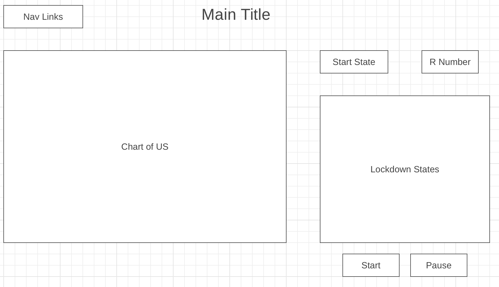

# US Outbreak Simulator

This is a simulator of a viral outbreak in the United States in the span of 1 year.

Live Link: https://us-outbreak-simulator.herokuapp.com/

Select the state in which the outbreak would start in addition to the infection rate and recovery rate of the virus. You can also set lockdown procedures for the states which they implement based on their current infection percentage. You may start, pause and reset the simulation as you please. Hover over states to see their statistics. You may also run concurrent simulations to see how the viral outbreak would affect the US for many years, although it would be based on the assumption that flight behavior remains constant.
<!-- ## Background -->

<!-- In light of the COVID-19 during the last 2 years and the many variants being discovered,
I wanted to create a simulator that mimicked the map created by Johns Hopkins University to record global cases.
This simulator may show that could have happened if countermeasures were done differently or if a future outbreak occurs within the United States.
The spread of infection will be based on flight data. -->
## Technologies, Libraries, and APIs Used

- D3 version 7
- Topojson v3
- Javascript
- CSS
- HTML
- CSV file of flight data
- Aviationapi for parsing airport data

## Functionality and MVPs

Completed Functions: 
- Set the state in which the outbreak starts
- Set the infectiousness of the virus (via the R number)
- Set the recovery rate of the virus
- Set which states proceed with lockdown protocols
- Get statistics from each state by hovering over the map
- Pause/Unpause the simulation
- Reset the simulation
- Start new simulation based on past simulation results

Missing Functions:

- An About modal describing the background of this simulator

Subpar Functions: 

- Flight data prevents infection to several states
- Long read time of local CSV file (It takes a few seconds on my personal machine, but it takes 90 seconds on heroku)

Bonus Features:

- Chart to show the top 10 most infected states
- Extend to global map
- Making a click functionality rather than a dropdown
- Animating the flights
- Create scroll bar for seeing past states

## Wireframes
https://wireframe.cc/knOstJ

- Nav links include links to this project's Github repo and my LinkedIn
- Legend indicates meaning of colors
- Dropdown input to set "Start State" on right
- Text input to set "R Number" on right
- Lockdown States include radio buttons to toggle each state and text input for percentage of population infection
- Start button under Lockdown States
- Pause button under Lockdown States

## Screenshots
Starting Map

Ending Map

